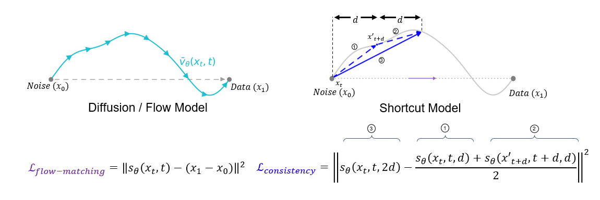
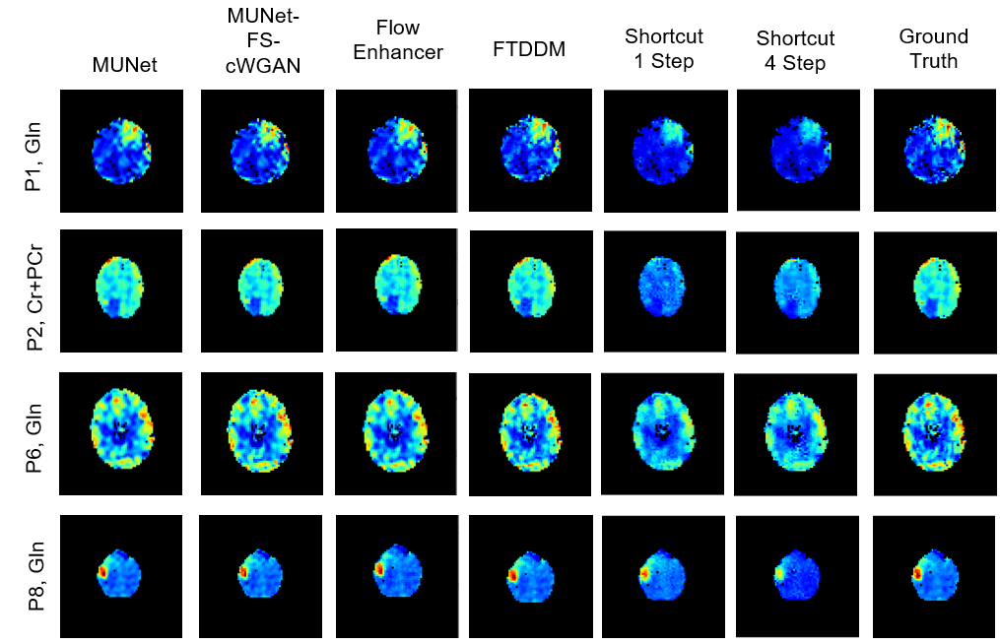

# A Shortcut Model for Magnetic Resonance Spectroscopic Imaging Super-Resolution

### Overview
Diffusion models are the current state of the art for Magnetic Resonance Spectroscopic Imaging (MRSI) super-resolution. 
Previous work demonstrated that the reverse diffusion chain can be shortened to 101 steps using a Flow-Truncated Denoising Diffusion Model (FTDDM), improving super-resolved image quality while reducing computational cost. 
However, 101 steps remains expensive and may be prohibitive for clinical or real-time use.
To address this, we explore shortcut models for MRSI super-resolution. 
Unlike standard diffusion models, shortcut models support single-step or multi-step generation by specifying the step size at sampling time, enabling a direct trade-off between inference speed and output quality. 
To our knowledge, this is the first application of single-step diffusion models in the medical imaging domain.

*Figure 1: Standard diffusion models require many small, uniform steps from noise to 
image (left). Shortcut models learn to take variable step sizes, enabling single-step 
or multi-step generation depending on the compute budget (right).*

### Results

*Figure 2: Qualitative comparison of super-resolved MRSI metabolite maps produced by CNN, GAN, Flow-Matching, Diffusion, and Shortcut methods.*

### Environment and Dependencies
 Requirements:
 * python 3.9
 * torch 2.8.0 (CUDA 12.6)
 * torchvision 0.23.0
 * triton 3.2.0
 * diffusers 0.32.2
 * huggingface-hub 0.29.2
 * safetensors 0.5.3
 * einops 0.8.1
 * numpy 1.26.3
 * scipy 1.13.1
 * opencv 4.11.0
 * scikit-image 0.24.0
 * pillow 11.0.0
 * matplotlib 3.9.4
 * imageio 2.37.0
 * lpips 0.1.4
 * tqdm 4.67.1
 * jupyterlab 4.4.6

### Directory
    main.py                             # script for training shortcut model
    train.py                            # training loop and EMA model management
    targets.py                          # shortcut and flow-matching target generation
    data_loader.py                      # dataset class and DataLoader construction
    shortcut_model.py                   # UNet2D with delta-time conditioning
    utils.py                            # k-space downsampling utility
    train_utils.py                      # seed setup, sample generation, loss plotting
    eval-save-results.py                # full evaluation with per-sample logging and image saving
    train-shortcut-mrsi.sh              # Train MRSI Shortcut SR Model
    test-shortcut-mrsi.sh               # Test MRSI Shortcut SR Model

This code is inspired by [Shortcut Models (JAX)](https://github.com/kvfrans/shortcut-models)
